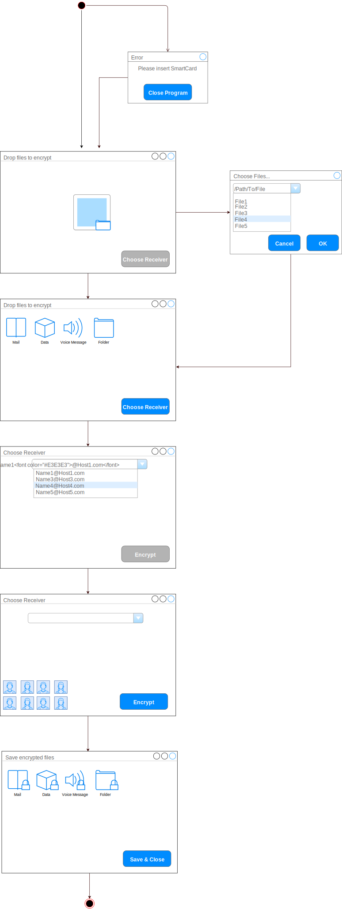
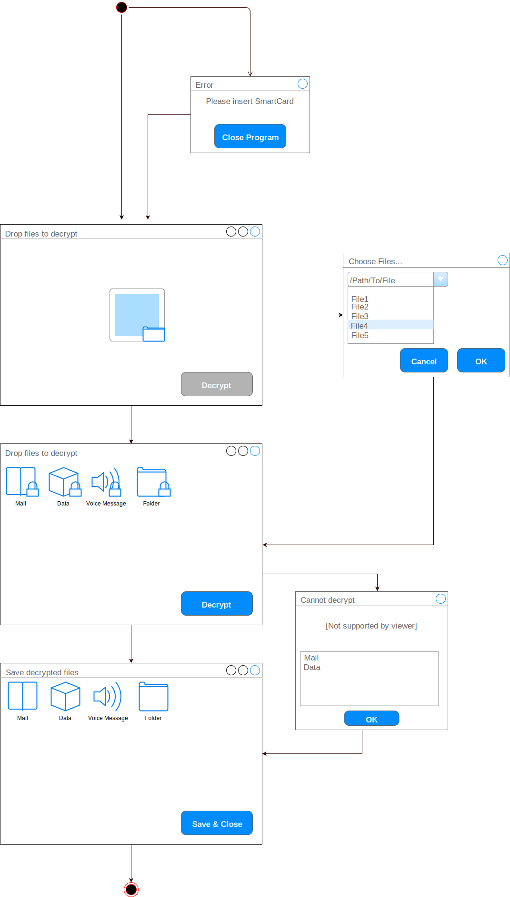

= SmartCard Verschlüsselung

== Use Cases

.Use Case Diagramm
[uml,file="use-case-diagramm.png"]
--

title Verschlüsselung mittels SmartCard

rectangle UseCases {
    (Verschlüsseln) as encrypt
    (Entschlüsseln) as decrypt
}

:User:
:Supervisor:

User --> (encrypt)
Supervisor --> (decrypt)
User --> (decrypt)
--

.Actor Definition
[cols="1,2a",width="100%",options="header"]
|====================
|   Name                |   Beschreibung
|   User                |   Der User ist ein Mitarbeiter eines Betriebs, der sicher und verschlüsselt mit anderen Personen kommunizieren oder Daten austauschen möchte.
|   Supervisor          |   Der Supervisor ist ein Manager oder ein Security-Beauftragter, der im Notfall alle verschlüsselten Kommunikationen und Daten entschlüsseln können muss.
|====================

.Verschlüsseln
[cols="1,2a",width="100%",options="footer"]
|====================
| *Name*               | Verschlüsseln 
| *Akteur*             | User 
| *Trigger*            | User will Datei verschlüsseln
| *Kurzbeschreibung*   | Das Programm verschlüsselt eine oder mehrere vom User ausgewählte Datei(en). Diese kann von einer oder mehreren vom User ausgewählte(n) Person(en) entschlüsselt werden.
| *Vorbedingungen*     | Mindestens eine Datei, mindestens ein Empfänger, eingesteckte SmartCard
| *Essentielle Schritte* |[cols="2,1", options="header"]
!===
! Intention der Systemumgebung ! Reaktion des Systems
! User startet Programm ! Programm ist bereit
! User steckt SmartCard ein ! Programm erlaubt Interaktion
! User wählt Empfänger aus ! Programm zeigt Empfänger an
! User gibt Datei(en) an ! Programm zeigt zu verschlüsselnde Dateien
! User startet Verschlüsselung ! Programm zeigt verschlüsselte Dateien an
! User beendet das Programm ! Programm ist beendet
| *Ausnahmefälle*      | SmartCard kann nicht gelesen werden, kein Speicherplatz
| *Nachbedingung*      | Dateien sind verschlüsselt und können nur durch Empfänger entschlüsselt werden
| *Abgrenzung*         | Keine Auswahl der Verschlüsselungsparametern, Kein Hinzufügen von Empfängern zur Auswahl, Nur Dateien verschlüsselbar
| *Fragen, Kommentare* | -
|====================

.Entschlüsseln
[cols="1,2a",width="100%",options="footer"]
|==================== 
| *Name*               | Entschlüsseln 
| *Akteur*             | User, Supervisor 
| *Trigger*            | User oder Supervisor will Datei entschlüsseln
| *Kurzbeschreibung*   | Das Programm entschlüsselt eine oder mehrere vom User oder Supervisor ausgewählte Datei(en).
| *Vorbedingungen*     | Mindestens eine Datei, eingesteckte SmartCard.
| *Essentielle Schritte* |[cols="2,1",options="header"]
!===
! Intention der Systemumgebung ! Reaktion des Systems
! User/Supervisor startet Programm ! Programm ist bereit
! User/Supervisor steckt SmartCard ein ! Programm erlaubt Interaktion
! User/Supervisor wählt Datei aus die er entschlüsseln kann ! Programm zeigt Datei an
! User wählt Datei aus die er nicht entschlüsseln kann ! Programm zeigt Fehlermeldung an
! User/Supervisor startet Entschlüsselung ! Programm zeigt entschlüsselte Dateien an
! User/Supervisor beendet das Programm ! Programm ist beendet
| *Ausnahmefälle*      | SmartCard kann nicht gelesen werden, kein Speicherplatz
| *Nachbedingung*      | Dateien sind entschlüsselt und können von jedem gelesen werden
| *Abgrenzung*         | Keine Auswahl der Verschlüsselungsalgorithmen, Nur Dateien entschlüsselbar,
| *Fragen, Kommentare* | -
|====================

== Anforderungen
.Anforderungen
[cols="1,2,3",width="100%",options="header"]
|====================
| Nr.   | Name                      | Beschreibung
|1      | Verschlüsseln von Dateien | Der User kann Dateien sicher verschlüsseln, sodass nur ausgewählte Personen diese lesen können.
|1.1    | Auswahl von Dateien       | Der User kann Dateien auswählen die er verschlüsseln will.
|1.2    | Auswahl von Empfängern    | Der User kann Empfänger auswählen, die die verschlüsselte Dateien öffnen können.
|1.3    | Verschlüsselung           | Die Daten werden mit `ECDHE-RSA-AES256-GCM-SHA384` sicher verschlüsselt.
|1.4    | Zur-Verfügung-Stellen von verschlüsselten Daten   | Die Daten werden verschlüsselt zum Download/Speichern zur Verfügung gestellt.
|2      | Entschlüsseln von Daten   | Der User kann Dateien entschlüsseln
|2.1    | Auswahl von zu entschlüsselnden Daten     | Der User kann eine verschlüsselte Datei auswählen.
|2.2    | Automatische Schlüssel-Auswahl    | Das Programm wählt automatisch den passenden Schlüssel aus. 
|2.3    | Entschlüsselung           | Die Daten werden mit einem passenden Algorithmus entschlüsselt.
|2.4    | Zur-Verfügung-Stellen von entschlüsselten Daten   | Die Daten werden entschlüsselt zum Download/Speichern zur Verfügung gestellt .
|3      | Safety   | Das Programm muss sicher zu benutzen sein.
|3.1    | Überprüfung der SmartCard | Das Programm überprüft, dass die SmartCard sicher und funktionell vorhanden ist.
|3.2    | Supervisor-Access         | Das Programm muss sicherstellen, dass der Supervisor aller verschlüsselten Dateien entschlüsseln kann.
|3.3    | Fehlerfeedback            |Liegt ein Fehlerfall vor wir der User oder Superuser über diesen informiert.
|====================

== Story Board

=== Verschlüsseln

.Verschlüsseln von Dateien

=== Entschlüsseln

.Entschlüsseln von Dateien

